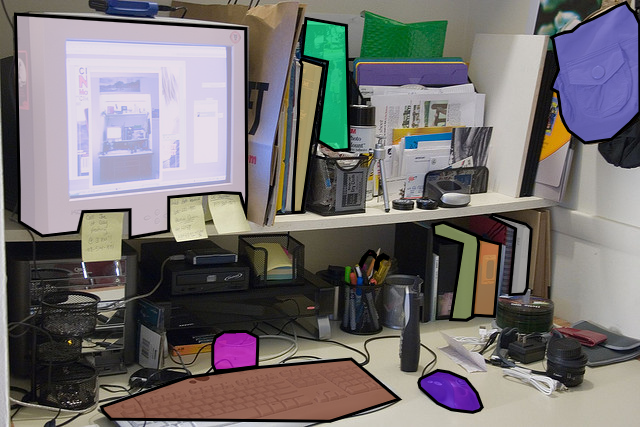

# ELAN_MBConv Backbone Testing and Custom Network Development

---
## Overview
- This repository contains my experimental work and development scripts for testing various [Keras3 pretrained backbones](https://keras.io/api/keras_cv/models/backbones/) on COCO and custom images, as well as the implementation of a custom architecture that i made using ELAN and MBConv blocks.
- The main aim of this research was to enhance small object detection in large, cluttered images by comparing multiple backbone models and developing a novel architecture for improved feature retention.

## Research Aim and Motivation
- My research focused on developing an efficient deep learning model for **detecting small objects in large, high-resolution images**, such as architectural floor plans with electrical legends.
- This is a continuation of the work I did on [automating floor plan detection tasks using **YOLOv8**](https://github.com/RamakrishnaReddyPalle/AAB-test-app.git).
- However, through my analysis, I found limitations in small object detection, which led me to experiment with different backbones and develop my own.

**The project involved:**
1. Testing multiple pretrained backbones (YOLOv8, CSPDarknet, Vision Transformer, EfficientNet) on standard and custom images to visualize activation maps and understand their feature extraction capabilities.
2. Developing my own backbone using **ELAN and MBConv blocks, YOLOv8 idea**, which addresses the limitations of existing models in detecting small objects under occlusion and clutter.

## Experimental Process

### Backbone Testing & Activation Maps
The initial experiments involved testing the following backbones, pretrained on the **[COCO 2017](https://cocodataset.org/#home)** dataset:
- **YOLOv8**: A state-of-the-art object detection model known for speed but struggled with fine-grained details in small objects.
- **Vision Transformer (ViT)**: Global attention made it less effective for small objects.
- **EfficientNet**: Balanced but missed crucial details in small objects.
- **CSPDarknet**: Showcased the best retention of small object details due to its deep feature extraction capabilities.

Each model was evaluated by passing:
- A **COCO 2017** image
  
- A **custom large image** created specifically for testing (3000x3000 pixels with small objects and colored noise to simulate occlusion and clutter).
  

### Custom Image Creation
To simulate real-world challenges like occlusion, clutter, and small object detection, I created a custom large image. This image includes:
- Small objects (similar to electrical legends in floor plans).
- Colored noise textures and various occlusions to test the model's robustness in detecting objects under challenging conditions.

- I visualized the **activation maps** from different layers of these models to analyze their performance, particularly focusing on small object detection.
- The custom image was crucial for understanding how different models handled cluttered environments and occlusions.

### Key Findings from the Experiments
1. **YOLOv8**: Struggled with small objects, especially in cluttered or noisy environments.
2. **EfficientNet**: Balanced between speed and accuracy but failed to capture intricate details.
3. **ViT**: Poor at small object detection due to its global attention mechanism.
4. **CSPDarknet**: Best at retaining small object details from the early layers, performing the best overall.

- **YOLOv8 Backbone Feature extraction maps:**
  
  

- **CSPDarknet53 Backbone Feature extraction maps:**
  
  

These insights led to the design and implementation of my custom model.

## Custom Backbone: ELAN_MBConv Architecture
Based on the findings, I developed a custom architecture that leverages:
- **CSP connections** crucial for small feature retention.
- **MBConv blocks** for efficient processing, using inverted residuals and depthwise convolutions.
- **E-ELAN** (Extended ELAN) and **PANNet** for feature aggregation.

This custom backbone is designed to:
- Improve small object detection.
- Handle large, high-resolution images with complex scenes.
- Achieve faster training convergence due to optimized backpropagation paths.

### Model Design

My ELAN_MBConv network is structured to retain more features in the early stages, which is crucial for detecting small objects that may get lost in deeper layers. The use of **MBConv** blocks ensures computational efficiency while maintaining high accuracy.

## Usage Instructions
### 1. Setting Up the Environment

All development was carried out on **Windows Subsystem for Linux (WSL)**. To replicate the environment, follow these steps:

1. Clone the repository:
   ```bash
   git clone https://github.com/RamakrishnaReddyPalle/What-does-feauture-extraction-look-like.git
   cd path/to/clone/folder
   ```

2. Install dependencies:
   ```bash
   pip install -r requirements.txt
   ```

### 2. Downloading COCO 2017 Dataset

Run the provided `.bat` script to download the COCO 2017 dataset. This script will automatically download and extract the dataset to the specified path after editing the path inside.

```bash
./download_COCO_2017.bat
```

### 3. Running Backbone Experiments

Each notebook in the `/notebooks` folder can be used to test different backbones. Simply open a notebook and follow the instructions to visualize the activation maps for:
- **COCO 2017** test images.
- **Custom high-resolution images**.

### 4. Building and Running Custom Model
```bash
Network Architecture Build-up/scratch_model.ipynb
```

## Results and Conclusion

Through this research, I identified key limitations in existing backbones for small object detection, particularly in cluttered scenes. The custom **ELAN_MBConv** backbone addresses these issues by combining efficient computation with high feature retention. Early results indicate:
- Superior small object detection.
- Faster convergence during training.
- Better handling of high-resolution, complex images.

## Licensing and Acknowledgements

All work in this repository is my own, and I claim full ownership of the code, experiments, and results. If you wish to use or modify this code, please refer to the **LICENSE** file for details on permissions.

### Citations and References

- The development of this custom model was inspired by concepts from **CSPDarknet**, **MBConv**, and **YOLOv8** architectures.
- Major references include:
  - **YOLOv8**: https://github.com/ultralytics/yolov8
  - **CSPDarknet**: "Cross Stage Partial Networks for Object Detection" (2020).
  - **EfficientNet**: "EfficientNet: Rethinking Model Scaling for Convolutional Neural Networks" (2019).

---
